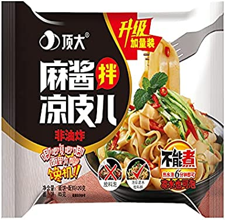

+++
title = "DingDa Cold Skin Sesame Paste Noodle"
date = 2023-02-02
summary = "Woeful"
[taxonomies]
categories = [ "Noodles" ]
rating = 1
manufacturer = "DingDa"
line = "Cold Skin"
[extra]
upc = 6922984202253
variety = "Sesame Paste"
+++

Rating: 1

My noodles were broken up when opened, though this could be down to shipping.
I observed package directions.
So steeped in ~500ml hot water for 6 minutes.
The noodles did have a really rough texture outside that held the sauce well.
The sesame paste was barely there though.
The seasoning packet didn't seem to have much oomf either.
The vingar wasn't bad but it came through as the dominant flavor.
