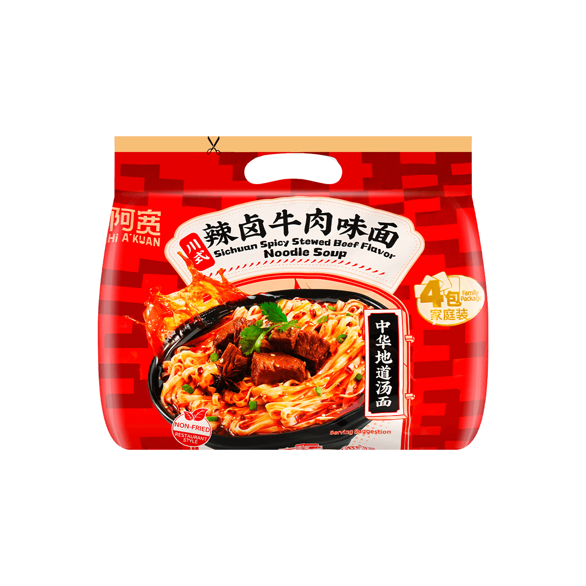

+++
title = "Sichuan Baijia Sichuan Spicy Stewed Beef Noodle Soup"
date = "2023-01-29"
summary = "An excellent base"
[taxonomies]
categories = [ "Noodles" ]
rating = 4
manufacturer = "Sichuan Baijia"
line = "Noodle Soup"
[extra]
upc = 6926410328128
variety = "Spicy Stewed Beef"
+++

Rating: 4

An excellent base for meals.
The flavor packet is really strong.
Hot but not spicy hot.
Strong aniseed and sichuan pepper flavor.
Not a weak or chalky rendition of 5-spice like many others.

Cooking:

The noodles are actually quite delicate.
I tried cooking them 3 minutes in 300ml water and they were mush.
Following the directions and soaking them gave a much better result.
The seasoning packet can really stand up to dilution.
I highly recommend making these dry and adding vegetables and some meat.
