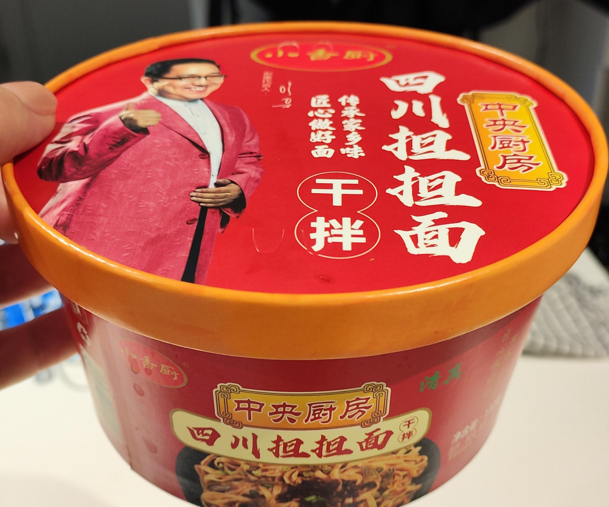

+++
title = "Sichuan Dan Dan Noodle"
date = "2023-04-01"
summary = "Not special but sound"
[taxonomies]
categories = [ "Noodles" ]
rating = 3
manufacturer = "Unknown"
line = "Unknown"
[extra]
upc = 6972606953377
variety = "Sichuan Dan Dan"
+++

Rating: 3

Noodles are wheat noodles but fat and wide.
Noodles like this are uncommon.
I steeped as per instructions but wasn't happy with how cooked the noodles were.
After the 6 minute steep I microwaved for ~1 minute.
The noodles boiled over quite strongly, glad I was watching.

The taste is quite nice, it almost tastes like there's pork added.
It's a little salty and chemically but not overwhelmingly so.
Medium numbing quality, this could support a few vegetables added.
The wet pouch of pickled beans was nice and snappy.
It was a little too salty when prepared dry.
Overall it was pleasant but I wouldn't pick it out specifically from a crowd.
